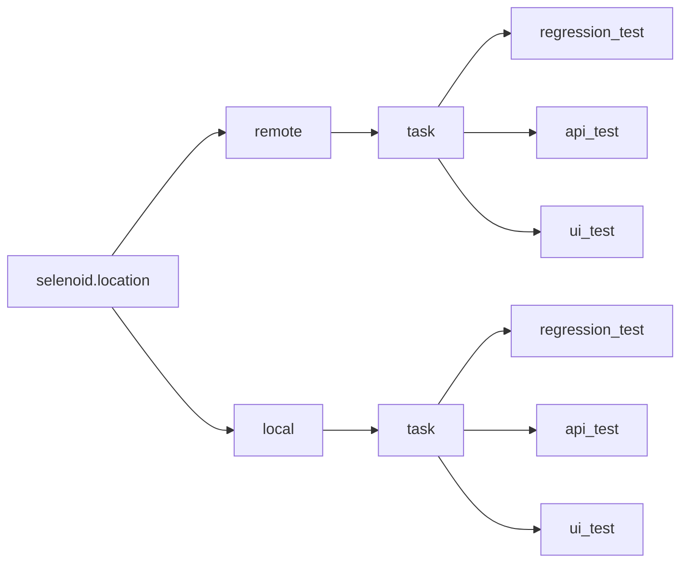
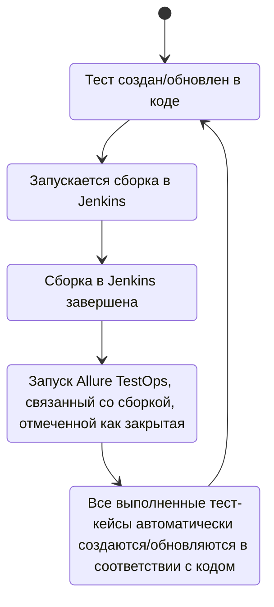

<h1 align="center"> Проект по автоматизации тестирования для закрепление полученных навыков на практике</h1>
<p  align="center">
</p>

# <a name="Содержание">Содержание</a>
+ [Описание](#Описание)
+ [Технологии и инструменты](#Технологии-и-инструменты)
+ [Варианты запуска](#Варианты-запуска)
    + [Команды для Gradle](#команды-для-gradle)
    + [Запуск в Jenkins](#запуск-в-jenkins)
+ [Telegram уведомления](#Telegram-уведомления)
+ [Результаты тестов в Allure Report](#Результаты-тестов-в-Allure-Report)
+ [Интеграция с Allure TestOps](#Интеграция-с-Allure-TestOps)
+ [Видео прохождения тестов](#Видео-прохождения-тестов)
+ [Локализация инфраструктуры в Docker](#Локализация-инфраструктуры-в-Docker)


# <a name="Описание">Описание</a>
##### Тестовый проект состоит из веб-тестов (UI) и тестов API

В проекте собраты тесты для следующих сервисов:
- [x] https://demowebshop.tricentis.com
- [x] https://github.com
- [x] https://hh.ru
- [x] https://reqres.in

Краткий список интересных фактов о проекте:
- [x] `Page Object` проектирование
- [x] Параметризованные тесты
- [x] Различные файлы конфигурации для запуска теста в зависимости от параметров сборки
- [x] Конфигурация с библиотекой `Owner`
- [x] Использование `Lombok` для моделей в API тестах
- [x] Использование request/response спецификаций для API тестов
- [x] Custom Allure listener для API requests/responses логов
- [x] Интеграция с `Allure TestOps`
- [x] Автотесты как тестовая документация
- [x] Локализация инфраструктуры в `Docker`


# <a name="Технологии и инструменты">Технологии и инструменты</a>
<p align="center">
<a href="https://www.jetbrains.com/idea/"></a>
<a href="https://www.java.com/"></a>
<a href="https://github.com/"></a>
<a href="https://junit.org/junit5/"></a>
<a href="https://gradle.org/"></a>
<a href="https://selenide.org/"></a>
<a href="https://aerokube.com/selenoid/"></a>
<a href="https://github.com/allure-framework/allure2"></a>
<a href="https://github.com/xeleron88/dostavka.magnit.ru_UI_API_MOBILE_test/blob/master/images/icons/allure-ee-logo.svg"></a>
<a href="https://www.jenkins.io/"></a>
<a href="https://www.docker.com/"></a>
<a href="https://telegram.org/"></a>
</p>

Автотесты в этом проекте написаны на `Java` использую `Selenide` фреймворк.\
`Gradle` - используется как инструмент автоматизации сборки.  \
`JUnit5` - для выполнения тестов.\
`REST Assured` - для тестирования REST-API сервисов.\
`Jenkins` - CI/CD для запуска тестов удаленно.\
`Selenoid` - для удаленного запуска браузера в `Docker` контейнерах.\
`Allure Report` - для визуализации результатов тестирования.\
`Allure TestOps` - как система управления тестированием.\
`Telegram Bot` - для уведомлений о результатах тестирования.\
`Docker` - как альтернативная инфраструктура для запуска тестов.

[Вернуться к оглавлению ⬆](#Содержание)

# <a name="Варианты запуска">Варианты запуска</a>

## <a name="Команды для Gradle">Команды для Gradle</a>
#### Локальный запуск регрессионных тестов:
```
gradle clean regression_test -Dselenoid.location=local
```
#### Удаленный запуск API тестов:
```
gradle clean api_test -Dselenoid.location=remote
```
#### Удаленный запуск UI тестов в многопоточном режиме (3 потока):
```
gradle clean ui_test -Dselenoid.location=remote -Dthreads=3
```
#### Параметры сборки подключаемые с помощью библиотеки [OWNER](https://github.com/matteobaccan/owner):
<code>selenoid.url</code> – адрес удаленного сервера, на котором будут запускаться тесты. </br>
<code>browser.name</code> – наименование браузера для запуска автотестов. </br>
<code>browser.version</code> – версия браузера для запуска автотестов. </br>
<code>browser.size</code> – настройка разрешения окна браузера для запуска тестов. </br>
<code>browser.timeout</code> – время ожидания появления элементов во время выполнения UI тестев. </br>
<code>browser.headless</code> – настройка, позволяющая отключить отображение браузера, при выполнении тестов. </br>
<code>browser.hold.open</code> – насторойка, позволяющая оставить окно браузера открытым после окончания выполнения тестов, используется для отладки тестов. </br>

Параметры сборки извлекаются из соответствующего файла конфигурации (в зависимости от значения `selenoid.location`):
```bash
src/test/resources/config/${selenoid.location}.properties
```

Допустимые комбинации:


[Вернуться к оглавлению ⬆](#Содержание)

## <a name="Запуск в Jenkins">Запуск в [Jenkins](https://jenkins.autotests.cloud/job/chilikinow.main-autotests-project/)</a>
Главная страница сборки:
<p  align="center">

</p>

Параметризованное задание Jenkins может быть запущено с необходимыми ***task*** и ***selenoid.location***:
<p  align="center">

</p>

Конфиденциальная информация (имена для входа и пароли) хранится в зашифрованном виде в хранилище учетных данных Jenkins.\
И относительно безопасно передается в сборку аргументами gradle, а его значения маскируются в логах.

После завершения сборки результаты тестирования доступны в:
>- <code><strong>*Allure Report*</strong></code>
>- <code><strong>*Allure TestOps*</strong></code> - результаты загружаются туда и тест-кейсы могут автоматически обновляться в соответствии с последними изменениями в коде.

[Вернуться к оглавлению ⬆](#Содержание)

# <a>Telegram уведомления</a>
Telegram-бот отправляет краткий отчет в указанный телеграм-чат по результатам каждой сборки.
<p  align="center">

</p>

[Вернуться к оглавлению ⬆](#Содержание)

# <a name="AllureReport">Результаты тестов в [Allure Report](https://jenkins.autotests.cloud/job/chilikinow.main-autotests-project/allure/)</a>

## Главная страница
Главная страница отчета Allure содержит следующие блоки:

>- <code><strong>*ALLURE REPORT*</strong></code> - отображает дату и время теста, общее количество запущенных тестов, а также диаграмму с процентом и количеством успешных, упавших и сломавшихся в процессе выполнения тестов
>- <code><strong>*TREND*</strong></code> - отображает тенденцию выполнения тестов для всех запусков
>- <code><strong>*SUITES*</strong></code> - отображает распределение тестов по сьютам
>- <code><strong>*CATEGORIES*</strong></code> - отображает распределение неудачных тестов по типам дефектов
<p align="center">
  
</p>

## Список тестов с шагами и тестовыми артефактами
На странице список тестов, сгруппированных по наборам, с указанием статуса для каждого теста.\
Может быть показана полная информация о каждом тесте: теги, продолжительность, подробные шаги.

<p align="center">
  
</p>

Также доступны дополнительные тестовые артефакты:
>- Last screenshot
>- Page source
>- Browser console logs
>- Video

<p align="left">
  
</p>

[Вернуться к оглавлению ⬆](#Содержание)

# <a>Интеграция с [Allure TestOps](https://allure.autotests.cloud/project/1957/dashboards)</a>
> Ссылка доступна только авторизованным пользователям.

Тест-кейсы в проекте импортируются и постоянно обновляются из кода,
поэтому нет необходимости в синхронизации ручных тест-кейсов и авто тестов.\
Достаточно создать и обновить авто тест в коде и тест-кейс всегда будет в актуальном состоянии.

## Allure TestOps Dashboard

<p align="center">
  
</p>



## Allure TestOps Test Cases

<p align="center">
  
</p>

[Вернуться к оглавлению ⬆](#Содержание)

# <a>Видео прохождения тестов</a>

<p align="center">
  
</p>

[Вернуться к оглавлению ⬆](#Содержание)

# <a>Локализация инфраструктуры в Docker</a>

Для выполнения авто тестов в случаях отсутствия доступа к внешней инфраструктуре, на локальном компьютере, 
с помощью Docker была разврнута локальная инфраструктура, выбор использования которой, осуществляется с помощью 
выбора `selenoid.location = local`

<p align="center">
  
</p>

#### Используемый файл `docker-compose.yml` для конфигурации Docker:
```
version: '3.8'
networks:
  selenoid:
    external:
      name: selenoid #docker network create selenoid
      
services:
  jenkins:
    image: jenkins/jenkins:lts
    container_name: jenkins
    user: root
    volumes:
      - "C:/services/jenkins:/var/jenkins_home"
      - /var/run/docker.sock:/var/run/docker.sock
    ports:
      - 8080:8080
      - 50000:50000
    networks:
      - selenoid
    
  selenoid:
    image: aerokube/selenoid:latest-release
    container_name: selenoid
    volumes:
      - "C:/services/selenoid:/etc/selenoid"
      - "C:/services/selenoid/video:/opt/selenoid/video"
      - "C:/services/selenoid/logs:/opt/selenoid/logs"
      - "/var/run/docker.sock:/var/run/docker.sock"
    environment:
      - OVERRIDE_VIDEO_OUTPUT_DIR=C:/services/selenoid/video
    command: ["-conf", "/etc/selenoid/browsers.json", "-video-output-dir", "/opt/selenoid/video", "-log-output-dir", "/opt/selenoid/logs", "-container-network", "selenoid"]
    ports:
      - "4444:4444"
    networks:
      selenoid: null
    
  selenoid-ui:
    image: "aerokube/selenoid-ui"
    container_name: selenoid-ui
    links:
      - selenoid
    ports:
      - "8888:8080"
    command: ["--selenoid-uri", "http://selenoid:4444"]
    networks:
      - selenoid           
```

[Вернуться к оглавлению ⬆](#Содержание)
